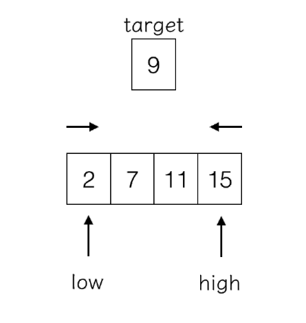

给定一个已按照升序排列的有序数组, 找到两个数使得它们相加之和等于目标数.

函数应该返回这两个下标值 `index1` 和 `index2`, 其中 `index1` 必须小于 `index2`

说明:
- 返回的下标值(`index1` 和 `index2`)不是从零开始的;
- 你可以假设每个输入只对应唯一的答案, 而且你不可以重复使用相同的元素.

实例:

    输入: numbers = [2, 7, 11, 15], target = 9
    输出: [1,2]
    解释: 2 与 7 之和等于目标数 9. 因此 index1 = 1, index2 = 2.
    


> 思路: 由于数组已经排序, 可以先计算数组收尾数字之和(`low`, `high`), 与 `target` 进行比较, 如果比 `target` 大, 可以进一步计算数字第一个数组与倒数第二个数字的和, 以此类推, 直到出现一对数字之和等于 `target`  
反之亦然, 如果收尾数字之后比 `target` 小, 可以进一步计算第二个元素与倒数第一个元素之间的和  
这两个过程在计算的时候时可以相互转换的, 有可能本来比 `target` 大, `high` 指针左移一位之后发现相加之和小于 `target`, 此时就需要 `low` 指针右移继续判断. 
    
```java
class Solution {
    public int[] twoSum(int[] numbers, int target) {
        int low = 0;
        int high = numbers.length - 1;
        int result[] = new int[2];
        while (true) {
            int sum = numbers[low] + numbers[high];
            if (sum == target) {
                result[0] = low + 1;
                result[1] = high + 1;
                break;
            }
            if (sum > target) {
                --high;
            } else {
                ++low;
            }
        }
        return result;
    }
}
```