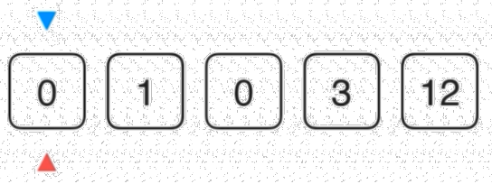
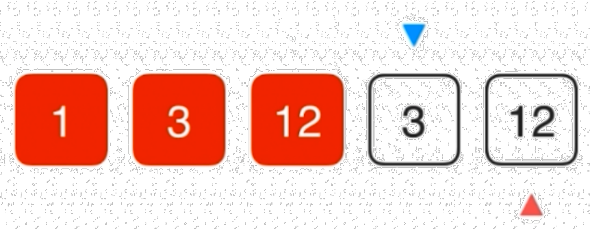

# 1. 题目介绍

出自 leetcode 第 283 题

> Given an array `nums`, write a function to move all `0`'s to the end of it while maintaining the relative order of the non-zero elements.
 
-
 
> 给定一个数组 `nums`，编写一个函数将所有 `0` 移动到数组的末尾，同时保持非零元素的相对顺序。
示例:
    
    输入: [0,1,0,3,12]
    输出: [1,3,12,0,0]
    
说明:
1. 必须在原数组上操作，不能拷贝额外的数组。
2. 尽量减少操作次数。

# 2. 求解
## 2.1 暴力解法

> 先将所有非 0 元素放入额外数组, 然后顺序赋值给当前数组, 剩下的元素赋值为 0

```java
class Solution {
    public void moveZeroes(int[] nums) {
        java.util.List<Integer> nonZeroElements = new java.util.ArrayList<>();
        for (int i = 0; i < nums.length; ++ i) {
            // 将所有非 0 元素放入 nonZeroElements 中
            if (nums[i] != 0) {
                nonZeroElements.add(nums[i]);
            }
        }
        
        for (int i = 0; i < nonZeroElements.size(); ++i) {
            // 将 nonZeroElements 放回原数组
            nums[i] = nonZeroElements.get(i);
        }
        
        for (int i = nonZeroElements.size(); i < nums.length; ++i) {
            // 将后面元素赋值为 0
            nums[i] = 0;
        }
    }
}
```

> 时间复杂度: O(N)  
空间复杂度: O(N)

## 2.2 原地移动
> 遍历数组, 同时一旦遇到非 0 元素, 就移动到前面的位置, 直到所有的非 0 元素都完成移动, 然后再将后面所有的元素赋值为 0



每找到一个非 0 的元素, 就移动到非 0 区域的后的第一个元素, 同时非 0 区域的下标 + 1



```java
class Solution {
    public void moveZeroes(int[] nums) {
        // nums 中, [0, k) 中的元素为非 0 区域
        int k = 0;
        for (int i = 0; i < nums.length; ++i) {
            // 遍历到第 i 个元素时, 保证[0 ... i]中所有非 0 元素都集中在 [0 ... k) 中
            if (nums[i] != 0) {
                nums[k++] = nums[i];
            }
        }
        
        for (int i = k; i < nums.length; ++i) {
            // 将 nums 剩余的位置全部填充 0
            nums[i] = 0;
        }
    }
}
```