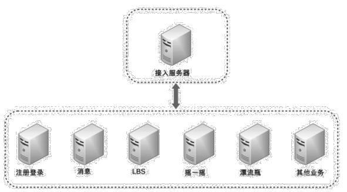
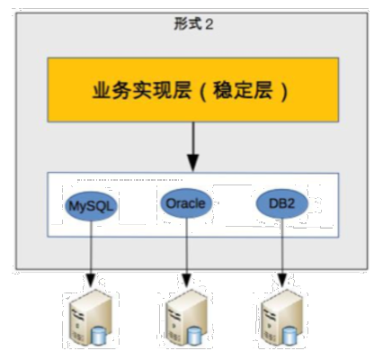

# 1. 架构设计的复杂度

> 架构设计的主要目的是为了解决软件系统复杂度带来的问题

下面先来分析一下架构设计常见的复杂度问题:

## 1.1 高性能
软件系统中, 高性能带来的复杂度主要体现在两方面:
- 单机内部高性能的复杂度
- 集群之间高性能的复杂度

### 1.1.1 单机复杂度
操作系统的复杂度直接决定了软件系统的复杂度

操作系统和性能最相关的就是进程和线程:
- 进程用来对应一个任务, 每个人物都有自己独立的内存空间, 进程间互不相关, 由操作系统来进行调度, 操作系统把 CPU 分成多个时间片, 每个时间片只能执行某个进程中的指令, 为了让进程能够相互通信, 可以使用管道, 消息队列, 信号量, 共享存储等;  
- 多进程让多个任务能够并行处理, 但自身还有缺点, 单个进程内部只能串行处理, 而实际上很多进程内部的子任务并不要求严格按照时间顺序执行, 也需要并行处理, 因此发明了线程, 操作系统调度的最小单位变成了线程, 而进程变成了操作系统分配资源的最小单位.

### 1.1.2 集群复杂度
通过大量机器来提升性能, 并不仅仅是增加机器这么简单, 让多台机器配合完成高性能, 是一个复杂的任务.

#### 1. 任务分配
> 每台机器都可以处理完整的任务, 不同的任务分配到不同的机器上执行

在 1 台服务器变为 2 台之后, 新引入的问题:
1. 需要新增一个任务分配器, 可能是硬件网络设备(F5, 交换机), 可能是软件网络设备(LVS), 也可能是负载均衡软件(Nginx);
2. 任务分配器和真正的业务服务器之间对连接的管理, 比如连接建立, 连接管理, 异常中断后如何处理等;
3. 任务分配器需要增加分配算法, 轮询, 加权等

如果对性能的要求更进一步, 单台任务分配器可能会成为瓶颈, 因此就需要多台任务分配器

此时架构的复杂性体现在:
1. 任务分配器由 1 台变为多台, 需要将不同用户分配到不同任务分配器上, 常见方法包括 DNS 轮询, CDN 等
2. 任务分配器和业务服务器的关系从 `一对多` 变成了 `多对多`
3. 随着节点数量的增加, 状态管理, 故障处理复杂度也增加

#### 2. 任务分解
通过任务分配的方式, 能够突破单台机器的瓶颈, 但如果任务本身很复杂, 单纯只通过任务分配的方式来扩展性能存在瓶颈, 因此需要考虑任务分解

通过这种任务分解的方式, 能够把原来统一但复杂的业务拆分成小而简但需要多个系统配合的业务系统.

任务分解可以提升性能的原因:
1. 简单的系统更容易做到高性能, 功能越简单, 影响性能的点就越少, 就更容易进行针对性的优化.
2. 可以针对单个子任务进行扩展, 只需要针对有瓶颈的子系统进行优化

## 1.2 高可用

> 系统无中断地执行其功能的能力, 代表系统的可用程度, 是进行系统设计的准则之一.

硬件和软件本质上都无法做到 `无中断`, 在架构设计上, 本质都是通过 `冗余` 来实现高可用.

    高性能通过增加节点扩展处理能力, 高可用通过增加节点冗余处理单元
    

### 1.2.1 计算高可用
> 计算的特点: 无论在那台机器上进行, 相同的算法和输入数据, 产出的结果都一样

### 1.2.2 存储高可用
> 存储的特点: 将数据从一台机器搬到另一台机器, 需要经过线路进行传输  
数据 + 逻辑 = 业务  
业务如果需要保持一致, 不同节点上的逻辑和数据必须一致

存储高可用的难点不在于如何备份数据, 而是在于如何减少或者规避不一致对业务造成的影响.

### 1.2.3 高可用状态决策
系统需要能够判断当前节点的状态是正常还是异常, 如果出现了异常就要采取行动来保证高可用

#### 1. 独裁式

> 存在一个独立的主体, 负责收集信息并完成决策

此模式不存在决策混乱, 但因为只有一个决策者, 如果决策者本身发生故障, 整个系统就无法实现准确的状态决策.

#### 2. 协商式

> 2 个独立的个体通过交流信息, 根据规则进行决策, 最常见的就是主备决策
- 2 个节点启动时都是备机
- 2 个节点建立连接, 并交换状态信息
- 某个节点作出决策, 成为主机, 另一个节点继续保持备机身份

协商式决策存在的问题:
1. 备机在连接中断的情况下认为主机故障, 自身升级为主机, 但实际上此时主机并没有故障, 出现 2 台主机
2. 备机在连接中断的情况下不认为主机故障, 此时主机故障

#### 3. 选举式

> 多个独立的节点通过投票的方式进行状态决策

每个个体做出自己的决策, 然后按照多数通过的规则来确定最终的状态

选举式决策有一个天生的问题: `脑裂`, 当发生网络分区时, 集群被割裂成多数派和少数派, 都无法和外界联系, 从而认为对方节点下线, 自身集群内部进行决策.
此时一般采用 `投票节点必须超过系统总节点半数` 的规则来处理.

## 1.3 可扩展性
> 可扩展性是指为了应对将来需求变化而提供的一种扩展能力, 当新需求出现时, 现有系统仅需少量变动就可支持

设计良好扩展性的系统, 有两个基本条件:
- 正确预测变化
- 完美封装变化

### 1.3.1 预测变化
预测变化的复杂性在于:
- 不能每个设计点都考虑可扩展性
- 不能完全不考虑可扩展性
- 所有的预测都存在出错的可能

### 1.3.2 封装变化
#### 1. 将变化封装在变化层, 将不变部分封装在独立的稳定层

通过玻璃变化层和稳定层, 会带来如下复杂度问题:
- 系统需要拆分出变化层和稳定层
- 需要设计变化层和稳定层之间的接口

## 1.4 低成本, 安全, 规模
### 1.4.1 低成本
如果架构方案设计一定规模的服务器, 成本就会变成一个非常重要的架构设计考虑点.

低成本给架构设计带来的复杂度主要体现在: 往往只有 `创新` 才能达到低成本目标, 比如引入新的技术:
- NoSQL 的出现就是为了解决关系型数据库无法应对高并发访问带来的访问压力
- 全文搜索引擎 的出现就是为了解决关系型数据库 like 搜索的低效问题
- Hadoop 的出现是为了解决传统文件系统无法应对海量数据存储和计算的问题

### 1.4.2 安全
#### 1. 功能安全
如 CSRF 攻击, SQL 注入等

现在很多开发框架都内嵌的常见的安全功能, 比如 MyBatis 防止 SQL 注入等, 也需要作为架构设计的一环去考虑

#### 2. 架构安全
传统的架构安全主要依靠防火墙, 防火墙最基本的功能就是网络隔离, 通过将网络划分成不同区域, 制定出不同区域之间的访问控制策略来控制不同欣喜程度区域间传送的数据流.

### 1.4.3 规模
规模带来的复杂度的主要原因是 `量变引起质变`, 当数量超过一定的阈值之后, 复杂度会发生质变
- 功能越来越多, 导致系统复杂度指数级上升
- 数据越来越多, 系统复杂度发生质变

# 2. 架构设计的原则
1. 合适原则: 合适优于业界领先
2. 简单原则: 简单优于复杂
3. 演化原则: 演化优于一步到位

# 3. 架构设计流程
结合复杂度来源和架构设计原则, 来设计一个场景 `旧浪微博`

## 3.1 识别复杂度
> 架构设计的本质是为了解决软件系统的复杂度问题, 因此需要先正确的分析系统的复杂性

架构的复杂度主要来源于 `高性能`, `高可用`, `可扩展` 三个方面

需要先将主要的复杂度问题列出来, 然后根据业务, 技术, 团队等综合情况进行排序, 优先解决当前面临最主要的复杂度问题

    假设旧浪微博是一个创业公司, 业务发展很快, 系统间协作效率很低:
    1. 用户发一条微博后, 微博子系统需要通知审核子系统进行审核, 然后通知统计子系统进行统计,
        再通知广告子系统进行广告预测, 接着再通知消息子系统进行统计消息推送...一条微博又十几
        个通知, 目前都是通过系统间接口调用, 每通知一个新系统, 微博子系统就要设计接口, 联调
        测试, 效率很低.
    2. 当用户到达 VIP 后, 等级子系统要通知福利子系统进行奖品发放, 要通知客服子系统安排专属
        服务人员等
        
    通过分析发现, 问题在于业务系统之间强耦合, 而 MQ 正好可以完成子系统的解耦.
    
    自研一个消息系统, 分析复杂度的过程如下:
    1. 消息的是否需要可靠性:
        假设旧浪微博系统用户每天发送 1000 万条微博, 那么微博子系统每天会产生 1000 万条消息,
        假设每个消息会有 10 个子系统读取, 那么其他子系统读取消息大约是 1 亿次;
        平均每秒写入消息数为 115 条, 读取的消息数应该是 1150 条, 考虑到系统不是完全平均的, 
        设计的目的应该是以峰值来计算, 峰值一般是平均值的 3 倍, 那么消息队列的 TPS 是345, QPS
        是 3450.
        因此高性能是复杂度之一;
    2. 是否需要高可用:
        对于微博子系统来说, 如果消息丢了, 导致没有审核, 是非常严重的事情; 对于等级子系统来说,
        如果用户到达相应等级, 系统没有奖励, 则用户会产生不满, 虽然也很关键, 但没有审核子系统丢
        消息那么严重;
        综合来看, 消息队列需要高可用性, 包括写入, 持久化, 消息读取都需要保证高可用.
    3. 是否需要高可扩展性:
        小修队列的功能很明确, 基本无需扩展, 因此可扩展性基本不是消息队列复杂度的关键.
    
## 3.2 设计备选方案

> 新技术都是在现有技术的基础上发展起来的, 现有技术又来源于先前的技术.  
将技术进行功能性分组, 可以大大简化设计过程. 

- NoSQL: kv 的存储和数据库索引其实是类似的, Memcache 只是把数据库索引独立出来做成了一套缓存系统;
- Hadoop 大文件存储方案: 基础其实是集群方案 + 数据复制方案
- Docker 虚拟化, 基础是 LXC(Linux Containers)
- LevelDB 的文件存储结构是 Skip List

设计备选方案时的原则:
1. 需要选择最合适的方案
2. 设计多个差异明显的备选方案
3. 备选方案不用过于详细

备选方案实战:

    在旧浪微博的例子中, 我们排查出消息队列系统的复杂度主要来源于: 
    1. 高性能消息读取
    2. 高可用消息写入
    3. 高可用消息存储
    4. 高可用消息读取
    
    现在开始设计备选方案:
    1. 采用开源方案 Kafka
        Kafka 是成熟的开源消息队列方案, 功能强大, 性能也很高, 而且已经比较成熟, 业界有很多大公司
        都在使用.
    2. 集群 + MySQL 存储
        消息系统使用 Java 开发, 选择基于 Netty 开发消息队列系统.
        系统设计的 QPS 是 13800, 及时单机采用 Netty 来构建高性能系统, 单台服务器支撑这么高的 
        QPS 还是有一定风险, 所以选择采取集群方式来满足高性能消息读取, 负载均衡采用简单的轮询.
        同理, 高可用写入与高性能读取一样, 可以采用集群的方案来满足, 因为消息只要写入一台服务器就
        算成功.
        高可用存储要求已经写入的消息在单台服务宕机的情况下不丢失;
        高可用消息消息读取要求已经写入的消息在单台服务器宕机的情况下可以继续读取;
        可以利用 MySQL 的主备复制来达到 "高可用存储" 的目的.
        总结下方案:
        - 采用数据分散集群的架构, 集群中服务器进行分组, 每个分组存储一部分消息数据;
        - 每个分组包含一组主备 MySQL, 分组内主备复制, 分组间数据不同步;
        - 正常情况下, 分组内主机对外提供消息写入和消息读取, 备机不对外提供服务; 主机下线的情况下, 
          备机对外提供消息读取的服务.
        - 客户端采用轮训的策略写入和读取消息
        
    3. 集群 + 自研存储方案
        在备选方案 2 的基础上, 将 MySQL 替换为自研实现的存储方案, 因为关系型数据库的特点并不是很
        契合消息队列的数据特点, 可以参考 Kafka 实现一套文件存储和复制方案
        
    4. 其他备选方案还可以参考 LevelDB 以及 Hbase 等
    
## 3.3 评估和选择备选方案
> 列出我们需要关注的质量属性点, 然后分别从这些属性的维度去评估每个方案, 再综合挑选适合当前情况的最优方案.

常见的方案质量属性点有:
- 性能
- 可用性
- 硬件成本
- 项目投入
- 复杂度
- 安全性
- 可扩展性

依据这个方式, 做上述三个备选方案的评价:

| 质量属性 | 引入 Kafka | MySQL 存储 | 自研储存 |
| --- | --- | --- | --- |
| 性能 | 高 | 中 | 高 |
| 复杂度 | 低 | 中(MySQL 存储和复制, 服务器集群) | 高(自研存储方案) |
| 硬件成本 | 低 | 高, 每个分区 4 台机器 | 低 |
| 运维成本 | 低 | 高 | 高 |
| 可靠性 | 高, 成熟方案 | 高, MySQL 保证存储 | 低, 自研初期难以保证 |
| 人力投入 | 低 | 中 | 高 |

## 3.4 详细方案设计
> 将方案设计的关键技术细节确定下来

例如 MySQL 分库分表, 需要确定哪些表需要拆分, 按照什么纬度拆分

- 需要对备选方案的关键细节有较深了解
- 通过分步骤, 分阶段, 分系统等方式, 尽量降低方案复杂度

详细方案设计实战:

    1. 数据库表如何设计?
        数据库设计两类表, 一类是日志表, 用于消息写入时快速存储到 MySQL 中; 另一类是消息表, 每个
        消息队列一张表;
        业务系统发布消息时, 首先写入到日志表, 日志表写入成功就代表消息写入成功; 后台线程再从日志表
        读取写入消息, 将消息写入到消息表中;
        业务系统读取消息时, 从消息表中读取;
        日志表表名为: mq_log, 包含字段: 日志 id, 发布者信息, 发布事件, 队列名称, 消息内容;
        消息表表名就是队列名称, 包含的字段: 消息 id(递增生成), 消息内容, 消息发布时间, 消息发布者;
        日志表需要及时清理已经写入消息表的日志数据, 消息表最多保存 30 填的消息数据;
    2. 数据如何复制?
        直接采用 MySQL 主从复制即可, 只复制消息表数据, 不复制日志表
    3. 主备服务器如何切换?
        采用 Zookeeper 来做主备决策, 主备都连接到 Zookeeper 建立自己的节点, 主机的路径:
        /mq/server/分区编号/master, 备机为 /mq/server/分区编号/slave, 节点类型 EPHEMERAL
        备机监听主机的节点消息, 当发现主机节点下线之后, 备机修改自己的状态, 对外提供服务.
    4. 业务服务如何写入消息?
        生产者和消费者, 每个角色都有唯一的名称
        MQ 系统提供 SDK 供各业务调用, SDK 从配置中读取所有消息队列系统的服务器信息, 采用轮询的方式
        发起写请求给主机, 如果某个主机无法响应或者返回错误, SDK 将发起请求到下一台服务器.
    5. 业务如何读取消息?
        消息队列服务提供 SDK 供各业务系统调用, 从配置中读取所有消息队列系统的服务器信息, 轮流向所有
        服务器发起下次读请求;
        消息队列服务需要记录每个消费者的消费状态, 及当前消费者已经读取到了哪条消息, 当收到消息的读取
        请求时, 返回下一条未被读取的消息给消费者
    6. 业务服务器和消息队列服务区之间的通信协议如何设计?
        考虑到后续可能采用不同的编程语言编写, 为了提升兼容性, 传输协议采用 TCP, 数据格式为 
        ProtocolBuffer.