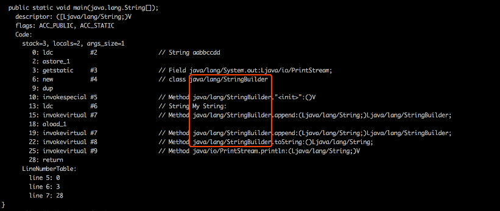

# 1. 基本概念
- String 是 Java 非常基础的类, 提供了构造和管理字符串的基本操作. 它是典型的 `Immutable` 类, 被声明为 `final class`, 所有的属性也都是 `final` 的. 也正是由于它的不可变, 类似拼接, 裁剪等操作实质上都会返回一个新的 String 对象. 由于字符串操作非常常见, 因此相关的操作往往会存在一定的效率问题;
- StringBuffer 是为了解决上面提到的拼接产生太多中间对象的问题而提供的类, 我们可以用 `append()` 或 `add()` 方法, 把字符串添加到已有序列的末尾或者指定位置, StringBuffer 本质是一个线程安全的可修改字符序列, 它保证了线程安全, 也随之带来了额外的性能开销, 因此除非有线程安全的需要, 否则依然不推荐使用;
- StringBuilder 在能力上和 StringBuffer 没有本质的区别, 但去掉了线程安全的部分, 有效减少了开销, 是绝大部分情况下进行字符串拼接的首选.

# 2. 扩展
## 2.1 字符串设计和实现
对 StringBuffer 来说, 它保证线程安全是通过把各种修改数据的方法都加上 `synchronized` 关键字实现.  
为了实现修改字符序列的目的, StringBuffer 和 StringBuilder 底层都使用了可修改的(char, JDK9 以后是 byte)数组, 二者都继承了 `AbstractStringBuilder`, 里面包含了基本操作, 区别仅在于最终的方法是否添加了 `synchronized`.

内部数组目前的实现时: 构建时初始字符串长度加 16, 如果确定拼接会发生多次, 可以指定合适的大小, 避免多次扩容.

在没有线程安全的情况下, 全部拼接操作都应该使用 StringBuilder 实现吗?

其实不是的, 在通常情况下, Java 编译器会进行优化:

样例代码:
```java
public class StringConcat {
    public static void main(String[] args){
        String myStr = "aa" + "bb" + "cc" + "dd";
        System.out.println("My String: " + myStr);
    }
}
```
先使用 `javac StringConcat.java` 进行编译  
再使用 `javap -verbose StrubgConcat.class`

JDK8 的输出片段是:



可以看到, 字符串拼接的操作会自动被 `javac` 转换为 StringBuilder 操作

## 2.2 字符串缓存
据 Oracle 公司的粗略统计, 把常见应用进行堆转储(Dump Heap), 然后分析对象组成, 会发现平均 25% 的对象是字符串, 并且其中半数是重复的, 如果能避免重复创建字符串, 可以有效降低内存消耗和对象创建开销.

JDK 6 提供了 `intern()` 方法, 目的是提示 JVM 把相应字符串缓存起来, 以备重复使用. 在我们创建字符串对象并调用 `intern()` 方法的时候, 如果已经有缓存的字符串, 就会返回缓存里的实例, 否则将其缓存起来.

但由于 JDK6 中被缓存的字符串实际存储在永久带中, 这个空间是有限的, 也基本不会被 `FullGC` 以外的 GC 场景涉及, 因此使用不当很容易 OOM.

在后续版本中, 这个缓存被放在堆中, 这样就极大避免了永久带占满的问题, 甚至在 JDK8 中将永久带彻底移除.

`intern()` 是一种显式的排重机制, 但也存在一定的副作用:
1. 并不方便, 每次都需要显式进行调用;
2. 难以保证效率, 开发阶段很难清除的预计字符串的重复情况;

不过在 `Oracle JDK 8u20` 之后, 推出了新的特性, 就是 G1 GC 下的字符串排重, 它是通过将相同字符串指向同一份数据来实现的, 是 JVM 层面的改变, 不需要 Java 类库做修改

此外, 在运行时, 字符串的一些基础操作会直接利用 JVM 内部的 `Intrinsic` 机制, 往往运行的都是特殊优化的代码, 而不是 Java 代码生成的字节码, `Intrinsic` 可以简单理解为一种利用 native 方式 hard-coded 的逻辑, 算是一种特殊的内联, 很多优化还是需要直接使用特定的 CPU 指令.

## 2.3 String 自身演化
在历史版本中, 是使用 `char[]` 来存储数据的, 这样非常直观, 但 Java 中的 char 是两个字节大小, 这样的实现造成了一定的浪费.

在 Java 9中, 引入了 `Compact Strings` 的设计, 将数据存储方式从 `char[]` 变成了 `byte[]` 加一个标识编码的 `coder`, 并且将相关字符串的操作类都进行了修改, 并且对绝大部分应用都是透明的.

不过在极端情况下, 字符串也出现了一些能力退化, 比如最大字符串的大小, 使用 `byte[]` 相比 `char[]` 的极限大小退化了一倍.