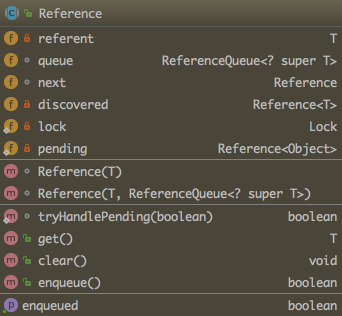

# 1. 基本概念
不同的引用场景, 主要体现在对象不同的可达性状态和对垃圾收集的影响.

## 1.1 强引用
最常见的普通对象的引用, 只要还有一个强引用指向一个对象, 就证明该对象还活着, 垃圾收集器不会去尝试回收该对象. 对于一个普通对象, 如果没有其他的引用关系, 只要超过了引用的作用域或者显式地将相应强引用赋值为 `null`, 就可以被回收.

## 1.2 软引用
是一种相对强引用弱化一些的引用, 可以让对象豁免一些垃圾收集, 只有当 JVM 认为内存不足的时候, 才会去试图回收软引用指向的对象, JVM 会确保在抛出 OOM 之前, 清理软引用指向的对象.  

根据这个特性, 软引用通常用来实现内存敏感的缓存, 如果还有空闲空间, 就可以暂时保存缓存; 如果内存空间已经不足, JVM 会自行清理, 这样就保证了使用缓存的同时, 不会耗尽内存.

## 1.3 弱引用
弱引用并不能使对象豁免垃圾收集, 仅仅是提供一种访问在弱引用状态下对象的途径, 这样可以用来构建一种没有特定约束的关系

比如维护一种非强制性的映射关系, 如果试图获取的对象还在, 就使用它, 否则需要重新实例化, 它同样是很多缓存实现的选择.

## 1.4 虚引用
也称幻想引用, 不能直接访问对象, 虚引用仅仅是提供了一种确保对象被 `finalize` 后, 做某些事情的机制, 比如, 通常用来做所谓的 `Post-Mortem` 清理机制.

可以用虚引用监控对象的创建和销毁.

# 2. 扩展
## 2.1 对象可达性状态流转分析
所有引用类型, 都是抽象类 `java.lang.ref.Reference` 的子类



除了虚引用(虚引用的 get 永远返回 null), 如果对象还没有被销毁, 都可以通过 get 方法获取原有对象. 这意味着利用软引用和弱引用, 我们可以将访问到的对象重新指向强引用, 也就是人为修改对象的状态可达性.

所以, 对于软引用和弱引用, 垃圾收集器可能会存在二次确认, 以保证处于弱引用状态的对象没有改变为强引用.

但如果我们错误的保持了强引用(比如赋值给了 static 变量), 那么对象可能就没有机会变成其他的可达性状态, 就会产生内存泄漏. 所以, 检查弱引用指向对象是否被垃圾收集, 也是诊断是否有特定内存泄漏的一个思路, 如果使用的框架中使用到弱引用又怀疑有内存泄漏, 就可以从这个角度检查.

## 2.2 引用队列
我们在创建各种引用关系并关联到响应对象的时候, 可以选择是否需要关联引用队列, JVM 会在特定的时机将引用 `enqueue` 到队列里, 我们可以从队列里获得引用进行相关后续逻辑.

尤其是虚引用, get 方法只能返回 null, 如果再不指定引用队列, 基本就没有意义了.

> 利用引用队列, 我们可以在对象处于对应状态时(对于虚引用, 就是前面说的被 `finalize` 了), 执行后期处理逻辑.

```java
Object counter = new Object();
ReferenceQueue refQueue = new ReferenceQueue<>();
PhantomReference<Object> p = new PhantomReference<>(counter, refQueue);
counter = null;
System.gc();
try {
    // remove 是一个阻塞方法, 可以指定 timeout, 或者选择一直阻塞
    Reference<Object> ref = refQueue.remove(1000L);
    if (ref != null) {
        // do something
    }
} catch (InterruptedException e) {
    // handle it
}
```

## 2.3 显式地影响软引用垃圾收集
软引用通常会在最后一次引用后, 还能保持一段时间, 默认值是根据堆维持的剩余空间计算的.