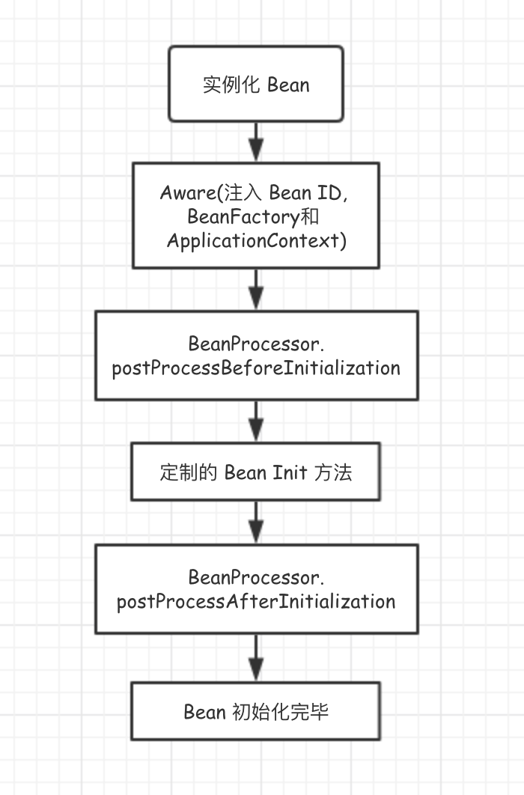

# 1. 生命周期
## 1.1 创建
创建 Bean 会经过一系列的步骤, 主要包括
1. 实例化 Bean 对象
2. 设置 Bean 属性
3. 如果通过各种 `Aware` 接口声明了依赖关系, 则会注入 Bean 对容器基础设施层面的依赖
    - BeanNameAware 会注入 Bean id
    - BeanFactoryAware 会注入 Bean Factory
    - ApplicationContextAware 会注入 Application Context
4. 调用 BeanPostProcessor 的前置初始化方法 `postProcessBeforeInitialization`
5. 如果实现了 `InitializingBean` 接口, 则会调用 `afterPropertiesSet` 方法
6. 调用 Bean 自身定义的 init 方法
7. 调用 BeanPostProcessor 的后置初始化方法 `postProcessAfterInitialization`
8. 初始化过程创建完毕

## 1.2 销毁
销毁过程会依次调用 `DisposableBean` 的 destroy 方法和 Bean 自定制的 destroy 方法

# 2. 作用域
- Singleton: 默认作用域, 单例
- Prototype: 针对每一个 getBean 请求, 容器都会单独创建一个 Bean 实例
- Request: 为每个 Http 请求创建 Bean
- Session : 为每个 Session 创建 Bean
- GlobalSession: 用于 Portlet 容器, GlobalSession 提供了一个全局性的 HTTP Session.