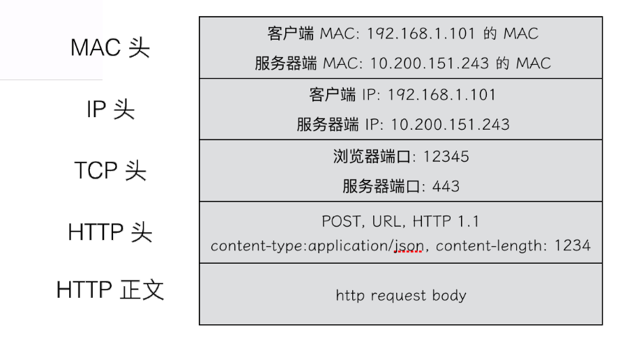

> 在浏览器中输入 www.baidu.com

首先, 浏览器会查询 DNS 或者 HTTPDNS, 得到 `www.baidu.com` 对应的 IP 地址, 浏览器将请求进行打包

DNS, HTTP, HTTPS 所在的层被称为应用层, 浏览器将应用层的包交给下一层完成.

TCP 协议中有两个端口, 浏览器监听的端口和服务器监听的端口, 操作系统根据端口号来判断得到的包应该交给哪个进程.

传输层封装完后, 将包交给操作系统的网络层, 网络层的协议是 IP 协议, 在 IP 协议中会有源 IP 地址, 即浏览器 IP 和目标 IP 地址.

操作系统知道目标 IP 后, 先判断是本地 IP 还是外部 IP, 如果是外部 IP, 就需要发送给网关, 当操作系统启动的时候, 就会被 DHCP 协议配置本机 IP 和默认网关 IP( 一般都是 192.168.1.1 )

操作系统通过 ARP 协议获取网关(192.168.1.1) 的 MAC 地址

操作系统将 IP 包交给 MAC 层, 网卡再将包发出去, 通过 MAC 地址找到网关

网关收到包后, 会根据路由表判断下一步怎么走, 每个局域网内部都可以使用 MAC 地址通信.

到达一个新的局域网, 就需要拿出 IP 头来, 当网络包知道了下一步去哪个网关, 就可以通过下一个网关的 MAC 地址找到这个网关, 直到走出最后一个网关.